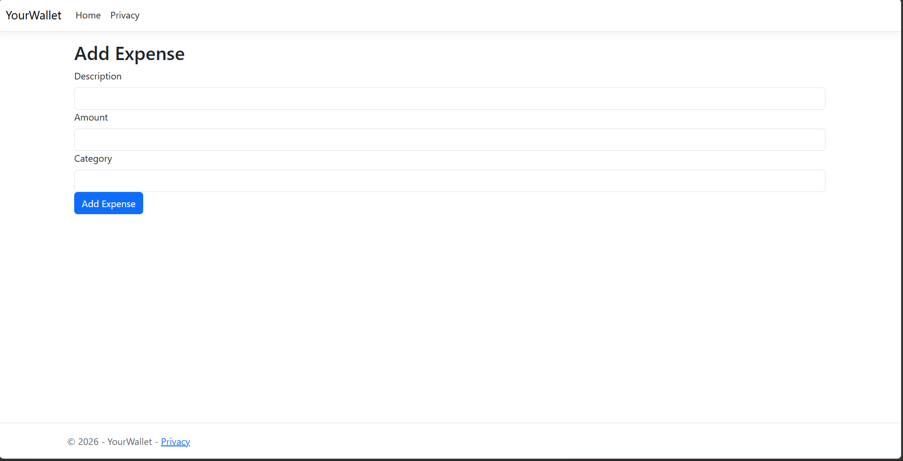
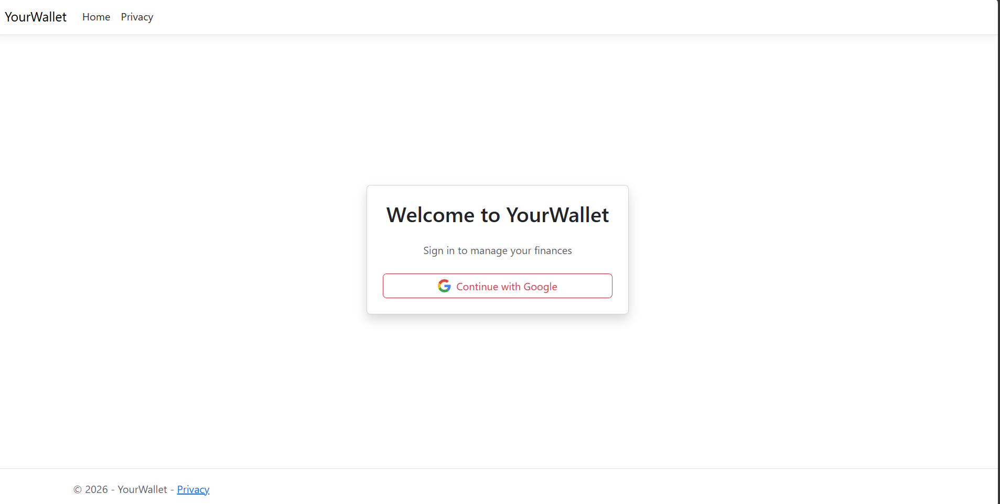
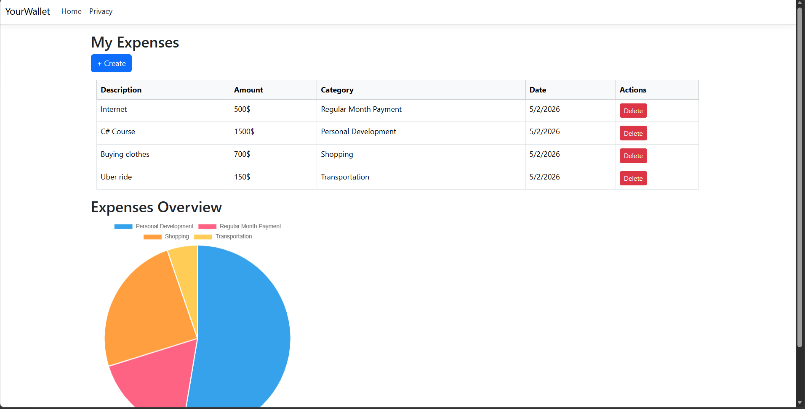

<a id="readme-top"></a>

<div align="center">

[![Contributors][contributors-shield]][contributors-url]
[![Forks][forks-shield]][forks-url]
[![Stars][stars-shield]][stars-url]
[![Issues][issues-shield]][issues-url]
[![LinkedIn][linkedin-shield]][linkedin-url]

<br />


# YourWallet

**A secure, multi-user personal finance tracker built with ASP.NET Core MVC**

[View Demo](https://github.com/OmarAdel1114/YourWallet) · [Report Bug](https://github.com/OmarAdel1114/YourWallet/issues) · [Request Feature](https://github.com/OmarAdel1114/YourWallet/issues)

</div>

---

<details>
  <summary>Table of Contents</summary>
  <ol>
    <li><a href="#about-the-project">About The Project</a></li>
    <li><a href="#built-with">Built With</a></li>
    <li><a href="#getting-started">Getting Started</a></li>
    <li><a href="#usage">Usage</a></li>
    <li><a href="#roadmap">Roadmap</a></li>
    <li><a href="#contact">Contact</a></li>
  </ol>
</details>

---

## About The Project



YourWallet is a personal finance tracker that helps users monitor and manage their daily expenses. Each user signs in securely with their Google account and gets their own private expense records — no other user can see or touch their data.

**Why YourWallet?**

* Tired of spreadsheets? YourWallet gives you a clean table and a live pie chart to understand your spending at a glance
* Built with real-world patterns — MVC architecture, service layer, dependency injection, and secure OAuth2 authentication
* Every expense is stamped with the owner's user ID at the database level, not just filtered in the UI

<p align="right">(<a href="#readme-top">back to top</a>)</p>

---

## Built With

[![ASP.NET Core][aspnet-shield]][aspnet-url]
[![C#][csharp-shield]][csharp-url]
[![SQL Server][sqlserver-shield]][sqlserver-url]
[![Entity Framework][ef-shield]][ef-url]
[![Google OAuth][google-shield]][google-url]
[![Chart.js][chartjs-shield]][chartjs-url]

<p align="right">(<a href="#readme-top">back to top</a>)</p>

---

## Getting Started

### Prerequisites

* [.NET 10 SDK](https://dotnet.microsoft.com/download)
* SQL Server (local instance)
* A Google Cloud project with OAuth2 credentials ([guide](https://console.cloud.google.com))

### Installation

1. Clone the repo
```bash
   git clone https://github.com/OmarAdel1114/YourWallet.git
   cd YourWallet
```

2. Set up Google OAuth secrets
```bash
   dotnet user-secrets init
   dotnet user-secrets set "Authentication:Google:ClientId" "YOUR_CLIENT_ID"
   dotnet user-secrets set "Authentication:Google:ClientSecret" "YOUR_CLIENT_SECRET"
```

3. Update the connection string in `appsettings.json`
```json
   "ConnectionStrings": {
     "DefaultConnection": "Server=YOUR_SERVER;Database=YourWallet_data;Trusted_Connection=True;"
   }
```

4. Apply database migrations
```bash
   dotnet ef database update
```

5. Run the application
```bash
   dotnet run
```

Visit `http://localhost:5246/Account/Login`

<p align="right">(<a href="#readme-top">back to top</a>)</p>

---

## Usage

### Login with Google


Click **Continue with Google** and sign in with your Google account. On your first login, your account is automatically created in the database.

### Managing Expenses


Click **+ Create** to add a new expense with a description, amount, and category. Your expenses are displayed in a table with the option to delete any entry.

### Expense Overview Chart


A dynamic pie chart at the bottom of the page groups your expenses by category so you can see where your money is going at a glance.

<p align="right">(<a href="#readme-top">back to top</a>)</p>

---

## Roadmap

- [x] Google OAuth2 authentication
- [x] Per-user expense isolation
- [x] Add and delete expenses
- [x] Interactive pie chart by category
- [ ] CI/CD deployment 
- [ ] Budget limits per category with threshold warnings
- [ ] Monthly wage tracking with real-time balance deduction
- [ ] Savings goal setting
- [ ] Recurring expense automation
- [ ] Exportable monthly/yearly reports (PDF)
- [ ] Multi-currency support
- [ ] JWT-based API authentication
- [ ] Mobile-responsive UI redesign

<p align="right">(<a href="#readme-top">back to top</a>)</p>

---

## Contact

**Omar Hawas**

[![LinkedIn][linkedin-shield]][linkedin-url]
[](mailto:omaradel1114@gmail.com)

Project Link: [https://github.com/OmarAdel1114/YourWallet](https://github.com/OmarAdel1114/YourWallet)

<p align="right">(<a href="#readme-top">back to top</a>)</p>

---

<!-- MARKDOWN LINKS & IMAGES -->
[contributors-shield]: https://img.shields.io/github/contributors/OmarAdel1114/YourWallet?style=for-the-badge
[contributors-url]: https://github.com/OmarAdel1114/YourWallet/graphs/contributors
[forks-shield]: https://img.shields.io/github/forks/OmarAdel1114/YourWallet?style=for-the-badge
[forks-url]: https://github.com/OmarAdel1114/YourWallet/network/members
[stars-shield]: https://img.shields.io/github/stars/OmarAdel1114/YourWallet?style=for-the-badge
[stars-url]: https://github.com/OmarAdel1114/YourWallet/stargazers
[issues-shield]: https://img.shields.io/github/issues/OmarAdel1114/YourWallet?style=for-the-badge
[issues-url]: https://github.com/OmarAdel1114/YourWallet/issues
[linkedin-shield]: https://img.shields.io/badge/LinkedIn-Omar_Adel-0A66C2?style=for-the-badge&logo=linkedin&logoColor=white
[linkedin-url]: https://linkedin.com/in/omar-adel-8a51b61b3

[aspnet-shield]: https://img.shields.io/badge/ASP.NET_Core-512BD4?style=for-the-badge&logo=dotnet&logoColor=white
[aspnet-url]: https://dotnet.microsoft.com/apps/aspnet
[csharp-shield]: https://img.shields.io/badge/C%23-239120?style=for-the-badge&logo=csharp&logoColor=white
[csharp-url]: https://learn.microsoft.com/en-us/dotnet/csharp/
[sqlserver-shield]: https://img.shields.io/badge/SQL_Server-CC2927?style=for-the-badge&logo=microsoftsqlserver&logoColor=white
[sqlserver-url]: https://www.microsoft.com/en-us/sql-server
[ef-shield]: https://img.shields.io/badge/Entity_Framework_Core-512BD4?style=for-the-badge&logo=dotnet&logoColor=white
[ef-url]: https://learn.microsoft.com/en-us/ef/core/
[google-shield]: https://img.shields.io/badge/Google_OAuth2-4285F4?style=for-the-badge&logo=google&logoColor=white
[google-url]: https://developers.google.com/identity/protocols/oauth2
[chartjs-shield]: https://img.shields.io/badge/Chart.js-FF6384?style=for-the-badge&logo=chartdotjs&logoColor=white
[chartjs-url]: https://www.chartjs.org
[railway-shield]: https://img.shields.io/badge/Railway-0B0D0E?style=for-the-badge&logo=railway&logoColor=white
[railway-url]: https://railway.app
